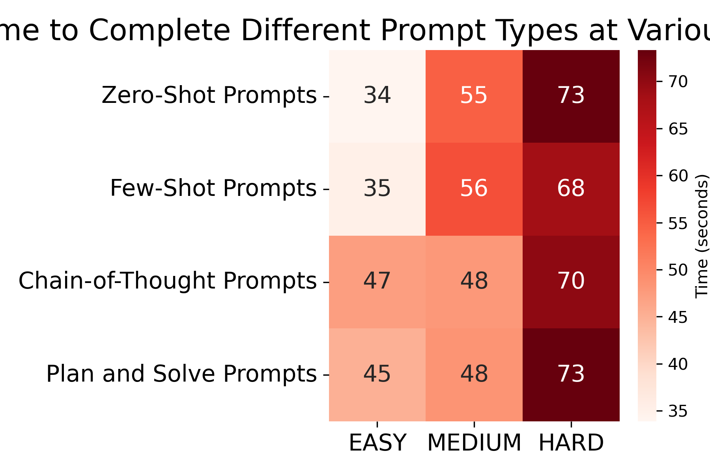
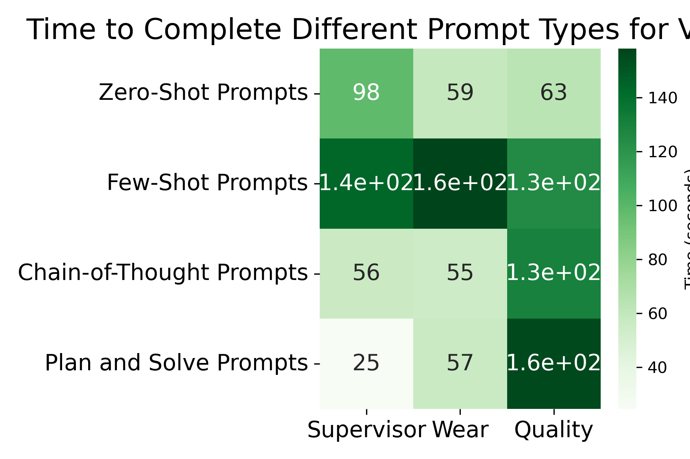

# Prompt Engineering Selection

## 📌 Folder Overview

This folder contains the files that are responsible for evaluating what prompts are best suited for the single and multi-agent systems. This step is done after the LLM_Choice/ folder steps, where the best LLM selected was granite3.3:2b. For this reason, now it is important to understand howw to prompt this LLM such that the responses remain with the same quality while decreasing the waiting time for a response.

## ✨ Files Specifications

* **Prompts_SA.ipynb**: In this file different prompt techniques are used for evaluating the response time of the single agent system. This is done by acquiring these values for each level of difficulty of user queries.

* **Prompts_MA.ipynb**: Same as the previous file, but done for the multi-agent system. In this scenario the user qqueries are averaged over the different level for each "part" of the system (Supervisor, Quality and Wear agents). 

* **SingleAgentAnalysis/**: Folder responsible for getting the analysis results presented in *Prompts_SA.ipynb* file.  

* **MultiAgentAnalysis/**: Folder responsible for getting the analysis results presented in *Prompts_MA.ipynb* file.

* **Analysis_SAvsMA/**: Folder responsible for comparing the results of single and multi-agent systems for the optimized prompts. These results are shown below as well as in the RESULT/ folder.

* **Tools_LLM/**: Just as in the LLM_Choice/ folder, the Tools_LLM/ folder only contains the implementation of the python functions that mimic the tools developed. This only needs to be changed if the same folder is changed inside the Tools/ folder. For example, if the new tools are created, this folder will be updated to also contain these tools.

## ⚙️ Analysis and Results

For the Multi-Agent and Single Agent system we got the following plots:

As it can be seen above, for the single agent system it is better to use Chain-of-Thought prompting, as it leads to a more constant time of response between all difficulties. This suggests that the agentic system is pondering different responses for all scenarios, leading to better and more consistent responses. 

For the multi-agent system, it is noticable that the supervisor agent reacts better under the Plan and Solve technique, while both Wear and Quality agents thrive under Zero-Shot promtps. This is expected, since the goal of the supervisor is to coordinate the other two agents focused on just using and retrieving values from the tools.

## 🚀 Possible Next Steps: 

* **Compare SA and MA for more Tools**: Increase the number of available tools and evaluate again the time response and accuracy when the number of tools is much larger.

* **Test different prompt techniques**: Test for different prompts techniques as only 4 were used in the scope of the project. More information regarding prompt techniques is available widely online.

* **Refine Prompts Used**: After selecting a good prompt, it is necessary to extend the number of user queries to try encounter faulty responses or hallucinations that occur within the system.